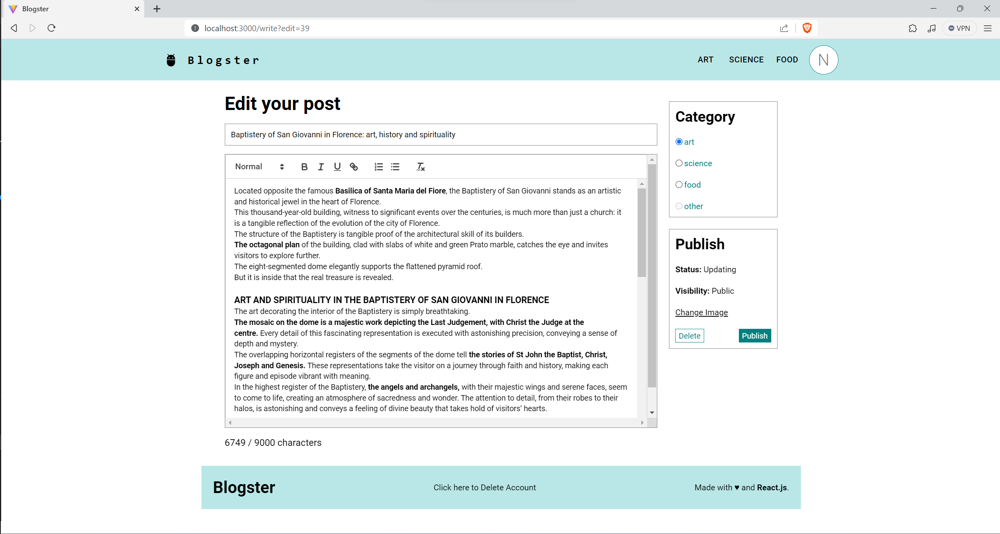

## Fullstack Blog App

A blogging platform built with React, TypeScript, and Node.js. This application allows users to create an account, write blog posts, edit or delete their own posts, and view posts from other users. It features infinite scrolling, category filtering, and JWT authentication. Non users can use the platform, but they cannot create posts or edit/delete posts.

## Quick Overview

- User account creation and authentication are supported.
- Login and logout functionality is available but not required to read posts and use the page.
- Pages features an infinite scrolling.
- Filter blog posts by categories.
- Users can create, edit, and delete their own blog posts.
- Users have the option to delete their accounts.
- Additional features and unit testing to be implemented soon.

## Demo

## Technologies used

- Backend: Node.js, Express, MySQL, JWT for authentication, cookies for session management
- Frontend: React, Vite, TypeScript, SCSS and more

## Key Dependencies

- [React Router](https://reactrouter.com/): For client-side routing in the React application
- [Moment.js](https://momentjs.com/): For manipulating and formatting dates
- [React Confirm Alert](https://www.npmjs.com/package/react-confirm-alert): For confirmation dialogs
- [React Icons](https://react-icons.github.io/react-icons/): For easily incorporating icons in the application
- [React Infinite Scroll Component](https://www.npmjs.com/package/react-infinite-scroll-component): For implementing infinite scrolling
- [React Quill](https://www.npmjs.com/package/react-quill): A Quill component to enable rich text editing
- [React Toastify](https://www.npmjs.com/package/react-toastify): For displaying notifications in the UI
- [Material-UI](https://material-ui.com/): A popular React UI framework for building responsive layouts

## Installation

The project consists of two main parts: the `api` for the backend and the `client` for the frontend. Follow the installation steps for each part.

### Backend API

1. Navigate to the `api` folder.
2. Run `npm install` to install all required packages.
3. Create a `.env` file in the `api` folder and set up your environment variables (see the Environment Variables section below).
4. Run `npm start` to start the backend server.

### Frontend Client

1. Navigate to the `client` folder.
2. Run `npm install` to install all required packages.
3. Run `npm run dev` to start the Vite development server.

After completing these steps, open [http://localhost:3000](http://localhost:3000) to view the frontend in your browser.

## Environment Variables

In order for the app to function correctly, the user must set up their own environment variables. There should be a .env file containing the following:

- SECRET_KEY=your_secret_key_here
- DB_HOST=your_database_host_here
- DB_USER=your_database_user_here
- DB_PASSWORD=your_database_password_here
- DB_DATABASE=your_database_name_here
